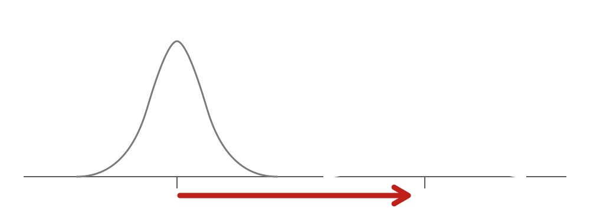
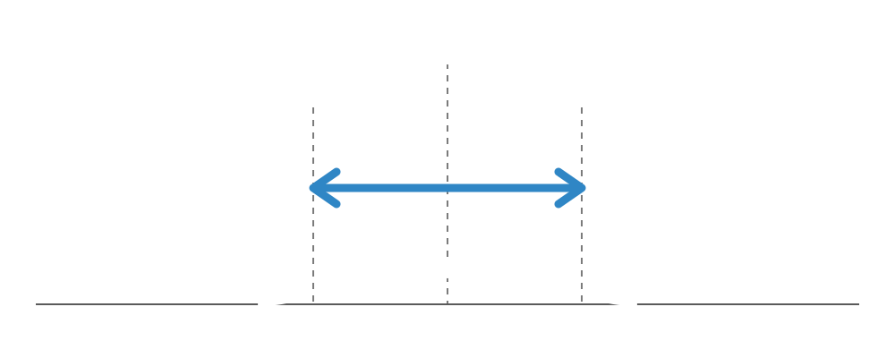

## &nbsp; {.divider data-state="chapter"}

[Parte 1]{.part}
[Diferenciar]{.dtitle}
[erro sistemático × acaso]{.lead}

## &nbsp; {data-state="bare"}

[Toda medida está sujeita a]{.lead}
[duas ameaças.]{.statement}

## Duas ameaças

::: {.box-row}

Erro sistemático

Viés

Erro aleatório

Acaso

:::

## &nbsp; {.divider data-state="chapter"}

[Erro sistemático]{.dtitle}
[bias / systematic error]{.en}

## Erro sistemático

[bias]{.en}

[Desloca o resultado **sempre na mesma direção.**]{.statement}

## Viés é deslocamento {data-state="bare"}

{.curve fig-alt="distribuição verdadeira deslocada para a enviesada"}

## &nbsp; {data-state="bare"}

[Uma balança que pesa]{.lead}
[sempre **2 kg a mais.**]{.statement}

[Todas as medidas erram — para o mesmo lado.]{.biglabel}

## &nbsp; {.divider data-state="chapter"}

[Erro aleatório]{.dtitle}
[random error / chance]{.en}

## Erro aleatório

[chance]{.en}

[Varia **sem padrão**, em torno do valor verdadeiro.]{.statement}

## Dispersão em torno do verdadeiro {data-state="bare"}

{.curve fig-alt="dispersão simétrica em torno do valor verdadeiro"}

## &nbsp; {data-state="bare"}

[Uma balança trêmula que]{.lead}
[oscila **±300 g.**]{.statement}

[Em média, converge para o valor verdadeiro.]{.biglabel}

## &nbsp; {data-state="bare"}

[Amostra grande corrige]{.lead}
[o **acaso.**]{.statement}

. . .

[Nunca corrige o **viés.**]{.statement .hl-red}

## Duas tarefas distintas

::: {.columns}
::: {.column width="50%"}
[Viés]{.kicker}

[**Prevenção**]{.statement}

no desenho do estudo
:::
::: {.column width="50%"}
[Acaso]{.kicker}

[**Estatística**]{.statement}

na análise dos dados
:::
:::

## &nbsp; {.divider data-state="chapter"}

[Prevenir o viés.]{.dtitle}
[Tratar o acaso.]{.dtitle}
[distintas · complementares · não substituíveis]{.lead}

## &nbsp; {.divider data-state="chapter"}

[Parte 2]{.part}
[Viés]{.dtitle}
[tendenciosidade · bias]{.lead}

## O que é viés

[bias / systematic error]{.en}

[Erro sistemático que distorce a **estimativa do efeito** de uma exposição sobre a doença.]{.statement}

## Quatro tipos

[bias]{.en}

::: {.incremental}
- Viés de **seleção**
- Viés de **aferição**
- Viés de **memória**
- Viés de **não-resposta**
:::

## &nbsp; {.divider data-state="chapter"}

[Viés de seleção]{.dtitle}
[selection bias]{.en}

## &nbsp; {data-state="bare"}

[A amostra **representa** a população?]{.statement}

. . .

[Se não — não se generaliza.]{.biglabel}

## Viés de seleção

[selection bias]{.en}

::: {.incremental}
- Estudo de hipertensão só em **clínica privada**
- Diabetes recrutando em **evento esportivo**
- Voto num **reduto eleitoral**
:::

## &nbsp; {.divider data-state="chapter"}

[Caso 1]{.part}
[Literary Digest, 1936]{.dtitle}
[Roosevelt × Landon]{.lead}

## O confronto

::: {.columns}
::: {.column width="50%"}
[Literary Digest]{.kicker}

[**2,4 milhões**]{.statement}

de respostas
:::
::: {.column width="50%"}
[Instituto Gallup]{.kicker}

[**~50 mil**]{.statement}

bem amostradas
:::
:::

## &nbsp; {.divider data-state="chapter"}

[2,4 milhões]{.bignum}
[de respostas previam **Landon.**]{.biglabel}

## &nbsp; {.divider data-state="chapter"}

[Errado.]{.bignum .red}
[Roosevelt venceu com 60,8%.]{.biglabel}

## &nbsp; {data-state="bare"}

[A amostra quase **50× maior**]{.statement}

. . .

[perdeu para a representativa.]{.statement .hl}

## Por que errou {data-state="bare"}

[Na Depressão, quem tinha **revista, carro e telefone** era rico — e republicano.]{.statement}

## &nbsp; {data-state="bare"}

[Tamanho de amostra]{.lead}
[**não corrige** viés.]{.statement}

## &nbsp; {.divider data-state="chapter"}

[Viés de aferição]{.dtitle}
[measurement bias]{.en}

## &nbsp; {data-state="bare"}

[O instrumento mede]{.lead}
[**o que diz medir?**]{.statement}

## Viés de aferição

[measurement bias]{.en}

::: {.incremental}
- **Balança** descalibrada (lê sempre 2 kg a mais)
- **Esfigmomanômetro** sem manutenção
- Questionário **sem validação cultural**
:::

## A escala enviesada {data-state="bare"}

> O quanto você gostou da aula?

[( ) A melhor da minha vida]{.statement style="font-size:0.9em"}
[( ) Excelente]{.statement style="font-size:0.9em"}
[( ) Ótima]{.statement style="font-size:0.9em"}
[( ) Boa]{.statement style="font-size:0.9em"}

## &nbsp; {data-state="bare"}

[Quatro opções —]{.lead}
[todas **positivas.**]{.statement}

[A média sobe sozinha.]{.biglabel}

## &nbsp; {.divider data-state="chapter"}

[Viés de memória]{.dtitle}
[recall bias]{.en}

## &nbsp; {data-state="bare"}

[Quantos cigarros você fumou]{.statement style="font-size:1.2em"}
[**nos últimos cinco anos?**]{.statement style="font-size:1.2em" .hl}

## &nbsp; {data-state="bare"}

[Os **casos** lembram a exposição]{.statement}
[melhor que os **controles.**]{.statement}

[Buscam explicar a própria doença.]{.biglabel}

## &nbsp; {.divider data-state="chapter"}

[Viés de não-resposta]{.dtitle}
[non-response bias]{.en}

## Viés de não-resposta

[non-response bias]{.en}

[Quem **responde** difere de quem **não responde.**]{.statement}

## Não-resposta

[non-response bias]{.en}

::: {.incremental}
- Pesquisa de **satisfação**: só os extremos respondem
- Survey por **e-mail**: respondem os de opinião forte
- **Efeito adverso**: responde quem teve queixa
:::

## &nbsp; {.divider data-state="chapter"}

[Caso 2]{.part}
[The Hite Report, 1976]{.dtitle}
[sexualidade feminina]{.lead}

## &nbsp; {.divider data-state="chapter"}

[84%]{.bignum}
[insatisfeitas com seus relacionamentos]{.biglabel}

## &nbsp; {.divider data-state="chapter"}

[70%]{.bignum}
[das casadas tinham amantes]{.biglabel}

## &nbsp; {.divider data-state="chapter"}

[4,5%]{.bignum .red}
[a taxa de resposta]{.biglabel}

## &nbsp; {data-state="bare"}

[Recrutamento em grupos de queixa]{.lead}
[**+** resposta seletiva]{.statement}
[**=** números espetaculares.]{.statement .hl-red}

## &nbsp; {data-state="bare"}

[Quem respondeu]{.lead}
[**não representa** as mulheres americanas.]{.statement}

## &nbsp; {.divider data-state="chapter"}

[Parte 3]{.part}
[Viés × Confundimento]{.dtitle}
[bias × confounding]{.lead}

## Dois mecanismos distintos

::: {.columns}
::: {.column width="50%"}
[Viés]{.kicker}

Erro do **pesquisador.**

[→ prevenir no desenho]{.hl}
:::
::: {.column width="50%"}
[Confundimento]{.kicker}

Uma **terceira variável.**

[→ ajustar na análise]{.hl}
:::
:::

## Confundimento {data-state="bare"}

[hábitos saudáveis]{.statement style="font-size:1.1em"}

[↘ causa &nbsp;&nbsp; causa ↙]{.muted}

[tomar vitaminas &nbsp;&nbsp;⟿&nbsp;&nbsp; melhor saúde]{.statement style="font-size:1em" .hl}

::: {.footer-bar}
Correlação mede associação — não é causa.
:::

## &nbsp; {.divider data-state="chapter"}

[Parte 4]{.part}
[Relações espúrias]{.dtitle}
[associações por mero acaso]{.lead}

## Correlações absurdas

[chance]{.en}

::: {.incremental}
- Filmes do **Nicolas Cage** × afogamentos em piscina
- Consumo de **queijo** × mortes por lençol
- Doutorados em engenharia × consumo de **mozzarella**
:::

## &nbsp; {data-state="bare"}

[Significância estatística]{.lead}
[**não atesta** mecanismo causal.]{.statement}

## &nbsp; {data-state="bare"}

[A pergunta certa:]{.lead}
[existe um **mecanismo plausível?**]{.statement}

## Critérios de Hill {data-state="bare"}

::: {.columns}
::: {.column width="50%"}
- Força
- Consistência
- Especificidade
- Temporalidade
- Gradiente biológico
:::
::: {.column width="50%"}
- Plausibilidade
- Coerência
- Experimento
- Analogia
:::
:::

## &nbsp; {data-state="bare"}

[Só a **temporalidade**]{.statement}
[é rigorosamente necessária.]{.statement}

## &nbsp; {.divider data-state="chapter"}

[Encerramento]{.dtitle}
[antes de aceitar qualquer associação]{.lead}

## &nbsp; {data-state="bare"}

[Pode ser **acaso?**]{.statement}

. . .

[Pode ser **viés?**]{.statement}

. . .

[Pode ser **confundimento?**]{.statement}

## &nbsp; {data-state="bare"}

[Só depois das três]{.lead}
[a hipótese **causal** merece consideração.]{.statement}

## Os quatro tipos de viés

| Tipo | A pergunta-chave |
|---|---|
| **Seleção** | A amostra representa a população? |
| **Aferição** | O instrumento mede o que diz medir? |
| **Memória** | A lembrança é acurada e simétrica? |
| **Não-resposta** | Quem responde difere de quem não? |

## Para aprofundar

[no site do curso]{.en}

- [Vieses nominados](../nominados/vies-berkson.qmd) — Berkson, Neyman, healthy worker…
- [Vieses por delineamento](../delineamentos/transversais.qmd)
- [Estudos de caso](../casos/literary-digest-1936.qmd)
- [Bibliografia](../referencias.qmd)

## &nbsp; {.divider data-state="chapter"}

[Obrigado.]{.dtitle}
[henriquealvarenga.com · ORCID 0000-0001-9799-5240]{.lead}

## Referências {.smaller}

::: {#refs}
:::
